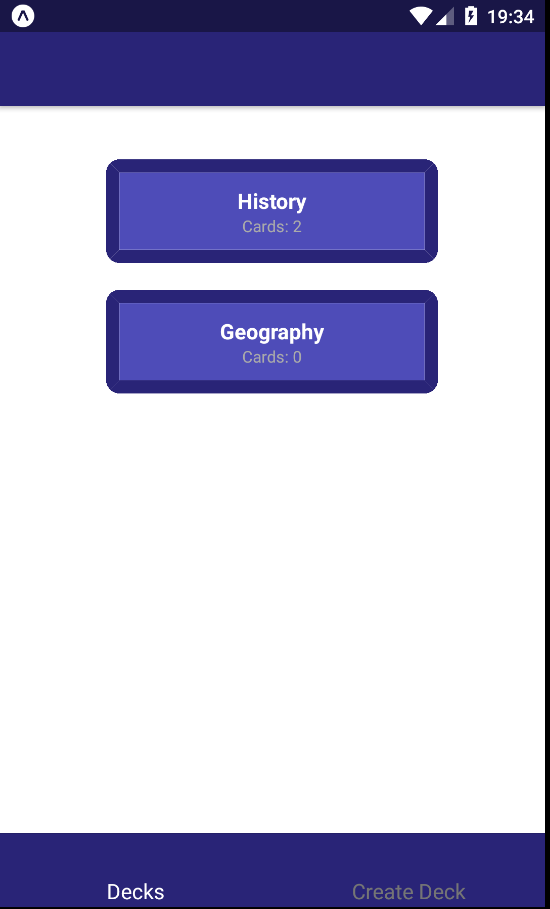
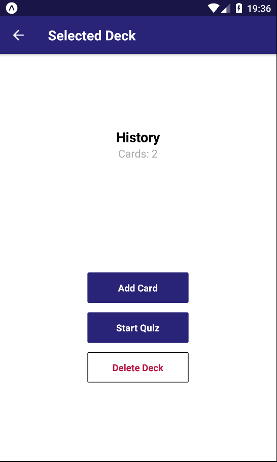

# MobileFlashCards
This project has been created as part of the [Udacity React Nanodegree](https://eu.udacity.com/course/react-nanodegree--nd019) course. The project provides a react native based app where you can define you own decks and flesh card to make it easy to validate your knowledge.
## Install
What you have to do to start developing:
* Install [Node.js](https://nodejs.org/en/download/)
* Install [Yarn](https://yarnpkg.com/lang/en/)
* Navigate into your repository and install all dependencies with `yarn install`
* Before you start install the `expo-cli` package with `yarn global add expo-cli`
* Install the `exp` package with the `yarn global add exp`
* Install `Genymotion` and setup a virtual device. You can find some help [here](https://docs.genymotion.com/latest/pdf/PDF_User_Guide/Genymotion-2.12-User-Guide.pdf)
* On windows set an environment variable. If you intalled the `Genymotion` to the defult path than add the following value to the `Path` variable:`C:\Program Files\Genymobile\Genymotion\tools\`
* Open a commandline terminal and enter `exp path`
* Start your Android emulator
* Now you are ready to start, navigate into the project folder and open a commandline terminal and enter `expo start`
* In the browser Click on the `Run on Android device/emulator`

Enjoy! :)

## Usage
Once you started the application it should be visible on your device/emulator.
* You will see the Home view where you see your `Decks` or you can create a new one on the `Create Deck` tab.

* If you select a deck you will get the individual deck view, where you can:
* * Add Card to deck
* * Start a Quiz - You can test your knowledge with the already added cards.
During Quiz you can watch the correct answer for the question and mark your answer as correct or incorrect.
At the end of the Quiz the result will be displayed of how many question did you answer correctly.

## Important
The application was only tested on the Android platform!
## License
It is free software, and may be redistributed under the terms specified in the [LICENSE](LICENSE) file.